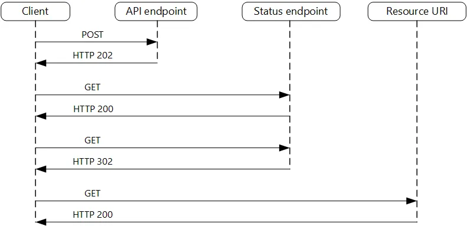
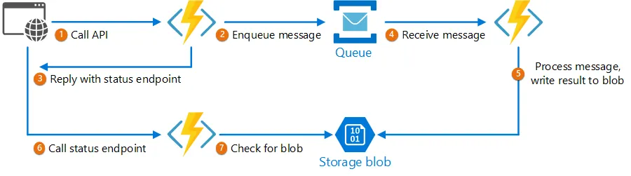
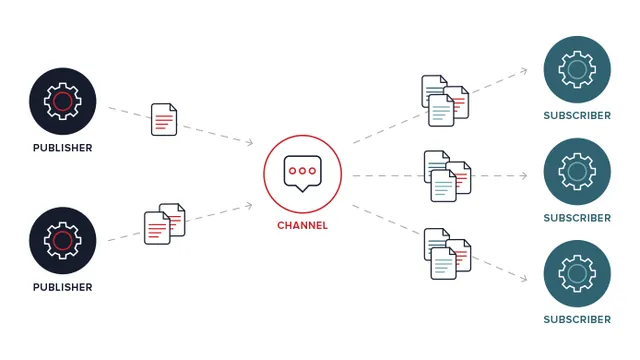
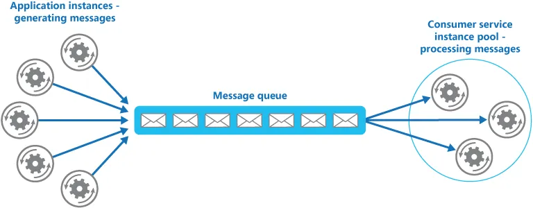

# Systems architecture notes

## [Architecture Design patterns](https://web3usecase.co/7-architecture-design-patterns-you-wish-you-knew-before-interview-e9806bc01b6f)
Architecture Design Patterns, in a nutshell, are design patterns for High Level Design.

### Circuit Breaker Pattern
*Prevents an application from continually attempting to execute an action that is likely to fail*, allowing it to proceed without waiting for the problem to be corrected or spending CPU cycles while determining the fault's duration.

*Allows an application to determine whether or not the issue has been remedied*. If the problem appears to be resolved, the program can attempt to perform the operation.

*Prohibits an application from doing a risky activity*. An application can use the Retry pattern to trigger an action through a circuit breaker to combine these two patterns. The retry logic, on the other hand, should be alert to any exceptions supplied by the circuit breaker and should cease repeat attempts if the circuit breaker indicates that a fault is not temporary.

### Event Sourcing Pattern

### SideCar Pattern

### CQRS

### Rate Limiting Pattern

### Strangler Fig

### Health Endpoint Monitoring Pattern

### Messaging patterns
A messaging infrastructure is required to connect the components and services, ideally in a loosely coupled manner to optimize scalability. Asynchronous messaging is widely used and has many advantages, but it also poses problems such as:
- **Message ordering**: Common issue that can occur in distributed messaging systems when messages are not processed in the order in which they were sent. This can happen due to factors such as network latency, message processing delays, or parallel processing of messages.
- **Poison message**: Message that, for some reason, cannot be processed correctly by a messaging system and instead causes errors or other negative effects in the system. This can occur due to various reasons, such as a message that contains invalid or corrupt data, a message that exceeds system limits, or a message that triggers a bug or vulnerability in the system.
- **Idempotency**: Situation that can arise in distributed messaging systems where the same message may be processed multiple times, causing unintended side effects. This can occur due to various reasons, such as network congestion, message retries, or failures in the message processing pipeline.

There are design patters that will help to mitigate this problems, we will focus on them.

#### Asynchronous Request Replay Pattern
Client applications rely on remote APIs to supply business logic and combine functionality in modern application developments. These APIs may be directly tied to the application or third-party shared services. These API requests are typically made using the HTTP(S) protocol and adhere to REST semantics.

HTTP polling is one solution to this problem. Client-side code can benefit from polling because it can be difficult to provide call-back endpoints or leverage long-running connections. Even when callbacks are possible, the additional libraries and services necessary can occasionally add undue complexity.

1. The client application sends a synchronous request to the API, which initiates a long-running action on the backend.
2. The API reacts as rapidly as feasible in synchronous mode. It returns an HTTP 202 (Accepted) response code, indicating that the request has been received and is being processed.
3. The response contains a location reference pointing to an endpoint that the client can poll to see the outcome of the lengthy operation.
4. Processing is offloaded to another component, such as a message queue, through the API.
5. It returns HTTP 200 for each successful call to the status endpoint. The status endpoint provides a resource indicating that the task is still in progress while it is still pending. When the task is finished, the status endpoint can either return a completion resource or redirect to another resource URL. If the asynchronous activity, for example, produces a new resource, the status endpoint will redirect to the URL for that resource.

##### Useful for
- Client-side code, such as browser apps, where providing call-back endpoints is problematic because the use of long-running connections adds too much complexity.
- Service calls where only the HTTP protocol is accessible and the return service is unable to trigger callbacks due to client-side firewall constraints.
- Service calls that must be integrated with legacy architectures that lack current callback technologies such as WebSockets or WebHooks.

#### Not great for
- Responses must be delivered to the client in real time.
- The client must collect a large number of results, and the received latency of those results is critical. Instead, consider a **service bus pattern** [^1].
- Server-side persistent network connections, such as WebSockets or SignalR, can be used. These services can be used to inform the caller of the outcome.
- You can use the network design to open ports to receive asynchronous callbacks or WebHooks.

### Publisher-Subscriber pattern
Create an asynchronous messaging subsystem that includes the following components:
- **Sender (publisher)**: Packages events into messages and sends them via the input channel using a specified message format.
- **Receiver (consumer)**: Subscribes to the input channel and receives messages in the specified format.
- **Message broker (middleware)**: Serves as an intermediary between the sender and receiver, ensuring reliable message delivery and providing features such as message queueing, load balancing, and message filtering.
- **Message format**: Defines the structure and content of messages that are sent and received. It includes information such as the message type, data payload, and any metadata needed for message processing.

#### Issues
- **Subscription handling**: Consumers must be able to subscribe to and unsubscribe from various channels through the messaging infrastructure.
- **Security**: To avoid eavesdropping by unauthorized users or applications, connecting to any communication channel must be controlled by security policy.

#### Useful for
- An application must broadcast information to a large number of users.
- An application must interact with one or more independently produced applications or services, which may use various platforms, programming languages, and communication protocols.
- An application can convey information to users without forcing them to respond in real time.
- The interconnected systems are intended to provide an ultimate consistency model for their data.
- An application must deliver data to several consumers, each of whom may have different availability requirements or uptime schedules than the sender.

#### Not great for
- An application has only a few consumers who require information that is notably different from that required by the producing application.
- An application necessitates near-real-time contact with users.

### Competing Consumers pattern
A cloud-based application is anticipated to manage a huge number of requests. Instead of processing each request synchronously, it is typical for the application to route them through a message system to another service (a consumer service) that handles them asynchronously.  This method helps to ensure that the application's business logic is not slowed down while the requests are being processed.

For a variety of reasons, the quantity of requests can fluctuate dramatically over time. A surge in user activity or aggregated requests from numerous tenants can result in unanticipated demand. During peak hours, a system may need to process hundreds of requests per second, yet at other times, the number may be quite low. 

The system can operate numerous instances of the consumer service to meet the varying workload. These customers, however, must be coordinated such that each message is only provided to a single consumer. To avoid one instance from becoming a bottleneck, the workload must also be distributed among consumers.

#### Solution
To implement the communication channel between the application and the consumer service instances, use a message queue. The application sends messages containing requests to the queue, and the consumer service instances receive and process the messages. This method allows the same pool of consumer service instances to handle messages from any application instance.

#### Issues
- **Message Ordering**: The order in which messages are received by consumer service instances is not guaranteed and does not always correspond to the order in which the messages were created.
- **Detecting poison messages**: A service instance can fail due to a faulty message or a task that requires access to resources that aren't available.

#### Useful for
- An application's workload is separated into jobs that can run asynchronously.
- Tasks are self-contained and can operate in parallel.
- The job volume is very changeable, necessitating a scalable solution.
- The solution must be highly available and resilient in the event that task processing fails.

#### Not so great for
- It is difficult to divide the application burden into discrete tasks, or there is a high degree of dependability between tasks.
- Tasks must be completed in a synchronous manner, and the application logic must wait for a task to complete before proceeding.
- Tasks must be completed in a specified order.

# Foot-notes

[^1]: The Service Bus pattern is a messaging pattern used in distributed systems to facilitate communication between various components or services. It involves the use of a message broker or bus that acts as an intermediary between producers and consumers of messages.    
The basic idea behind the pattern is that each service publishes messages to the service bus, and other services subscribe to these messages based on their specific needs. The service bus is responsible for ensuring that the messages are delivered reliably, even in the presence of failures or network outages.