# Table of contents

- [Table of contents](#table-of-contents)
- [Design patterns](#design-patterns)
- [Object Oriented Programming - OOP](#object-oriented-programming---oop)
  - [Basics of OOP](#basics-of-oop)
  - [Objects and classes](#objects-and-classes)
  - [Class hierarchies](#class-hierarchies)
  - [Pillars of OOP](#pillars-of-oop)
    - [Abstraction](#abstraction)
    - [Encapsulation](#encapsulation)
      - [C++ example](#c-example)
    - [Inheritance](#inheritance)
    - [Polymorphism](#polymorphism)
  - [Relations Between objects](#relations-between-objects)
    - [Dependency](#dependency)
    - [Association](#association)
    - [Aggregation](#aggregation)
    - [Composition](#composition)
  - [Summary](#summary)
- [Software design principles](#software-design-principles)
  - [Code reuse](#code-reuse)
- [Design patterns](#design-patterns)
  - [What's a Design Pattern?](#whats-a-design-pattern)
  - [What does the patter consist of?](#what-does-the-patter-consist-of)
  - [Classification of patterns](#classification-of-patterns)
- [Design principles](#design-principles)
  - [Encapsulate what varies](#encapsulate-what-varies)
    - [Encapsulation on a method level](#encapsulation-on-a-method-level)
    - [Encapsulation on a class level](#encapsulation-on-a-class-level)
  - [Program to an interface, not an implementation](#program-to-an-interface-not-an-implementation)
    - [Example](#example)
  - [Composition over inheritance](#composition-over-inheritance)
    - [Example](#example)
  - [SOLID principle](#solid-principle)
    - [Single responsibility principle](#single-responsibility-principle)
      - [Example](#example)
    - [Open / Closed principle](#open--closed-principle)
      - [Example](#example)
    - [Liskow substitution principle](#liskow-substitution-principle)
      - [Checklist](#checklist)
      - [Example](#example)
    - [Interface segregation principle](#interface-segregation-principle)
      - [Example](#example)
    - [Dependency Inversion Principle](#dependency-inversion-principle)
      - [Example](#example)
- [Catalog of design patterns](#catalog-of-design-patterns)
  - [Creational Design patterns](#creational-design-patterns)
  - [Structural design patterns](#structural-design-patterns)
  - [Behavioral design patterns](#behavioral-design-patterns)
# Design patterns

# Object Oriented Programming - OOP

## Basics of OOP

- Is a paradigm.
- The idea is to wrap pieces of data and behavior related to that data into bundles called **objects**.
- The objects are a set of **"blueprints"** called **classes**.

## Objects and classes

- As a quick reminder of UML diagrams:

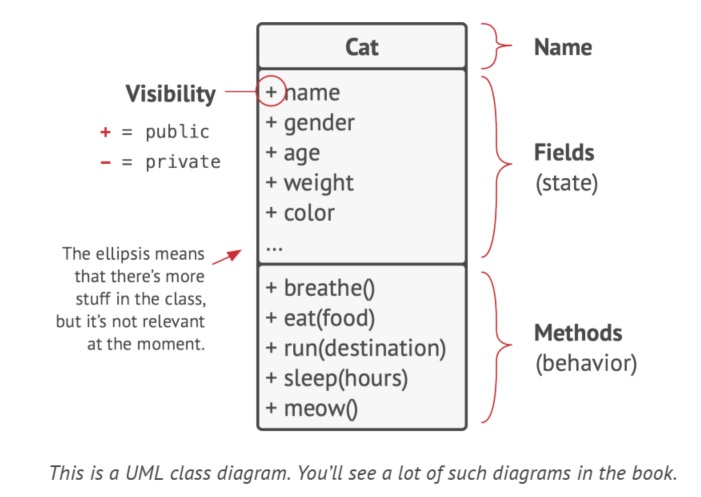

- You have a cat named Oscar. Oscar is an object, an instance of the **cat** class.
>
- Every cat has standard attributes: name, sex, age, weight, etc. These are the **class's fields**.
- All cats behave similarly, they: sleep, eat, run, etc. These are the **class's methods**.
- Collectively, fields and methods can be referenced as the **members** of their class.
>
- Data stores inside the object's fields is often referenced as **state**, and all the object's methods define its **behavior**.

## Class hierarchies
- In a program we usually have more than one class. Some of these classes might be organized into **class hierarchies**.
- Now imagine a **Dog class**, turns out that dogs and cats have a lot in common: name, sex, age, etc. Dogs can sleep, eat and run, same as cats. So we can define the base **Animal class** that would list all the common attributes and behaviors. 
>
- A parent class is called **superclass** and its children are **subclasses**. 
- Subclasses inherit state and behavior from their parent, defining only attributes or behaviors that differ.
>
- In this example, the **cat class** would have the **meow method** and the **dog class** the **bark method**. 

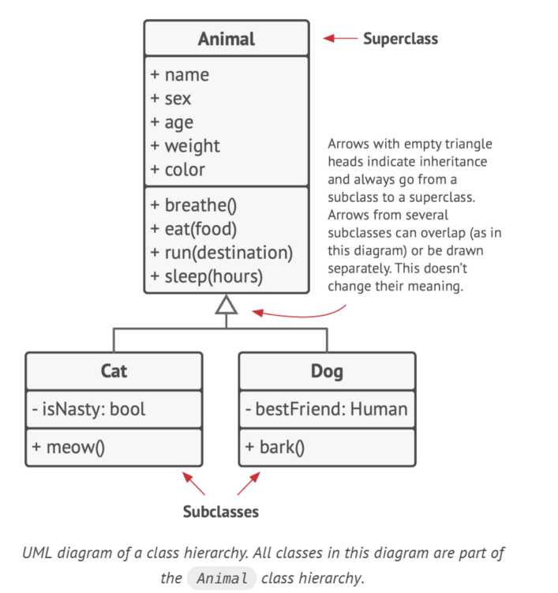

- We can go one level deeper and create a more general class for all living organisms. Then it will become a superclass for **animals** and **plants**. This pyramid of classes is a **hierarchy**.

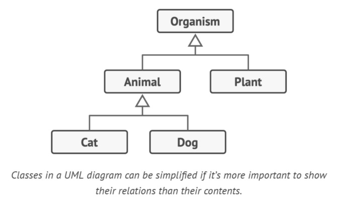

- **Subclasses can override the behavior of methods** that they inherit from parent classes. 
- A subclass can either completely replace the default behavior or just enhance it with some extra stuff.

## Pillars of OOP
- Object oriented programming is based on four pillars:

### Abstraction
- Objects *model* attributes and behaviors of real objects in a specific context. For example, an **Airplane Class** could exist in a flight simulator and a flight booking application. But what they model is very different:

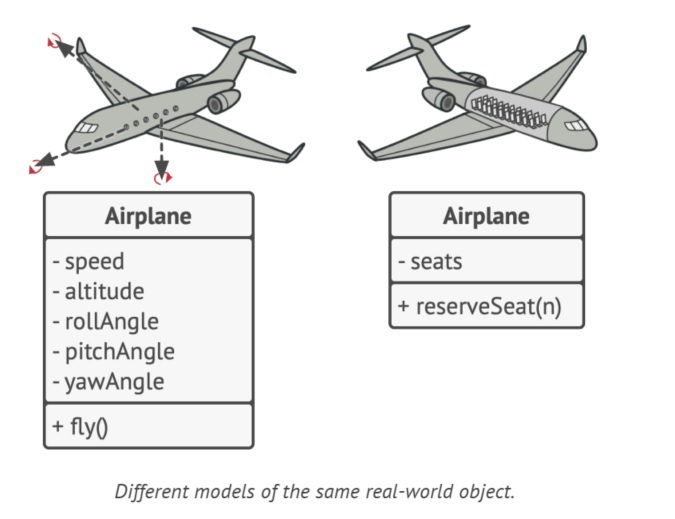

- **Abstraction** is a model of a real-world object or phenomenon, limited to a specific context, in which represents all details relevant to this context with high accuracy and omits all the rest.

### Encapsulation
- To start a car engine, you only need to turn a key or press a button. You've also have a steering wheel, a gear knob and some pedals. This illustrates how each object has an **interface** or in other words, a public part of an object open to interactions with other objects.
- *Encapsulation* is the ability of and object to hide parts of its state and behaviors from other objects. 

- *Encapsulate* something means to make it **private**, in other words accessible only from within the methods of its own class. There is a less restrictive mode called **protected** that makes a member of a class available to subclasses as well.

- Interfaces and abstract classes / methods are based on concepts of abstraction and encapsulation.

#### C++ example

- An interface describes the behavior or capabilities of a C++ class without committing to a particular implementation of that class. In C++, interfaces are implemented using abstract classes.

- A class is made abstract by declaring at least one of its functions as pure virtual function. A pure virtual function is specified by placing "= 0":

```
// Base class
class Shape {
   public:
      // pure virtual function providing interface framework.
      virtual int getArea() = 0;
      
      void setWidth(int w) {
         width = w;
      }
   
      void setHeight(int h) {
         height = h;
      }
   
   protected:
      int width;
      int height;
};
```
- The purpose of an **abstract class** (often referred to as an ABC) is to provide an appropriate base class from which other classes can inherit. Abstract classes cannot be used to instantiate objects and serves only as an **interface**. Attempting to instantiate an object of an abstract class causes a compilation error.

- Thus, if a subclass of an ABC needs to be instantiated, it has to implement each of the virtual functions, which means that it supports the interface declared by the ABC. Failure to override a pure virtual function in a derived class, then attempting to instantiate objects of that class, is a compilation error.

- Classes that can be used to instantiate objects are called **concrete classes**. Here is a continuation of the code above:

```
// Derived classes
class Rectangle: public Shape {
   public:
      int getArea() { 
         return (width * height); 
      }
};
```

- **Designing Strategy**
	- An object-oriented system might use an abstract base class to provide a common and standardized interface appropriate for all the external applications. Then, through inheritance from that abstract base class, derived classes are formed that operate similarly.

	- Imagine you have a **FlyingTransport** interface with a method **fly(origin, destination, passengers). When designing an air transportation simulation, you could restrict the **Airport** class to work only with objects that implement the **FlyingTransport** interface. After this, you can be sure that any object passed to an airport object would be able to arrive or depart from this type of airport.

	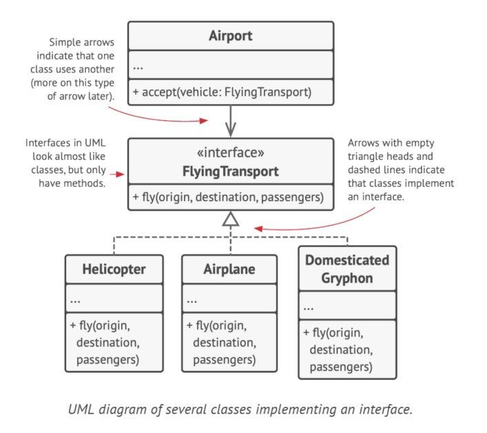

	- You could change the implementation of the **fly** method in these classes in any way you want (as long as the signature of the method remains the same as declared in the interface).

### Inheritance
- Is the ability to build new classes on top of existing ones. If you want to create a class that's slightly different from an existing one, you can extend the existing class and put extra functionality into a resulting subclass, which inherits fields and methods of the superclass (this avoids duplicating code).

- As a consequence you have the same interface as their parent class. 
	- You can't hide a method in a subclass if it was declared in the superclass. 
	- Also, you must implement all abstract methods, even if they don't make sense for tour subclass.

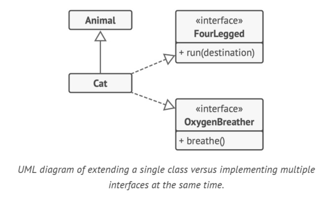

### Polymorphism
- Most **animals** can make sounds. We can anticipate that all subclasses will need to override the base **makeSound** method so each subclass can emit the correct sound.
- So we can declare it *abstract*, this let us omit any default implementation of the method in the superclass, but force all subclasses to come up with their own.

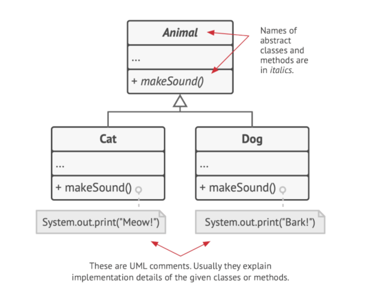

- Imagine the following scenario:
	- You have a bag with several cats and dogs, and after taking one out you don't know for sure what it is. But when it makes a sound, the animal emits a specific sound depending on its concrete class.
```
// Base class
class Animal 
{
   public:
    virtual void sound() = 0;// pure virtual function providing interface framework.
};
 
// Derived classes
class Cat: public Animal 
{
   public:
      void sound() 
      { 
         std::cout << "Meow!" << std::endl;
      }
};

class Dog: public Animal 
{
   public:
      void sound() 
      { 
         std::cout << "Woof!" << std::endl;
      }
};
 
int main(void) 
{
    std::vector<std::unique_ptr<Animal>> bag;
    bag.emplace_back(new Dog); bag.emplace_back(new Cat); bag.emplace_back(new Dog); 
    bag.emplace_back(new Cat); bag.emplace_back(new Dog); bag.emplace_back(new Dog);

    for (int i = 0; i < bag.size(); i++)
        bag[i]->sound();
        
    return 0;
}
```
```
Output:
Woof!
Meow!
Woof!
Meow!
Meow!
```
- The program doesn't know the concrete type of the object obtained, but thanks to a mechanism called *polymorphism*, the program can trace down the subclass of an object whose method is being executed and run the appropriate behavior.

- *Polymorphism* is the ability of a program to detect the real class of an object and call its implementation, even when its real type is unknown in the current context.

## Relations Between objects
In addition to *inheritance* and *implementation* there are other types of relations between objects. 

### Dependency

- There is a dependency between two classes if some changes to the definition of one class might result in modifications to another class. 
- Typically occur when you use concrete class names in your code. For example:
	- When you specify types in method signatures.
	- When instantiating objects via constructor calls.
- You can make a dependency weaker if you make your code dependent on interfaces or abstract classes instead of concrete classes.

### Association

- Is a relationship in which one objects uses or interacts with another. Is a specialized kind of dependency, where an object always has access to the objects with which interacts, whereas simple dependency doesn't establish a permanent link.

- Lets look a combined example to understand the differences between *association* and *dependency*. \
Imagine we have a `Professor` class:
```
#include <iostream>
#include <random>
#define MAX_GRADE 10

class Course 
{
    private:
        int m_performance;
        std::string m_name;
        
    public:
        Course(int performance, const char * name) : m_performance(performance), m_name(name) {}
        
        int test()
        {
            return rand()%(m_performance - 1);  
        }

        // This method is a consumer (doesn't modify fields of the class)
        // So const keyword must be used at the end        
        void printCourseName() const
        {
            std::cout << m_name << std::endl;    
        }
};

class Student 
{
    public:
        int takeTest(int performance)
        {
            return performance%(MAX_GRADE-1);   
        }
};

class Professor 
{
    Student student;

    public:
        void teach(Course& course) 
        { 
            std::cout << "You've got a " << student.takeTest(course.test()) << " on "; 
            course.printCourseName();
        }
};

int main()
{
    Professor professor;
    Course mathematics(1550, "Mathematics");
    Course geography(1700, "Geography");
    Course spanish(2000, "Spanish");
    
    professor.teach(mathematics);
    professor.teach(geography);
    professor.teach(spanish);
}
```
```
output:
You've got a 8 on Mathematics
You've got a 6 on Geography
You've got a 8 on Spanish
```

- Look at the `teach` method. It takes `Course` class as an argument, which then is used in the body of the method. If someone changes the `test` method of the `Course` class (alters its name, adds required parameters, etc), our code will break. This is called a dependency.

- Look at the `student` field and how it's used in the `teach` method. We can say that `Student` class is a dependency for professor. If `takeTest` changes, the professor's code will break. However, the `student` field is always accessible to any method of the `Professor`, the `Student` class is not just a dependency but also an association.

### Aggregation

- Is a specialized type of association that represents "one-to-many", "many-to-many" or "whole-part" relations between multiple objects.
- Usually, under aggregation, an object has a set of other objects and servers as a container or collection. The component can exist without the container and can be linked to several containers at the same time.

### Composition

- Is a specific kind of aggregation, whereas object is composed of one or more instances of the other. The distinction between this and other relations is that the component can only exist as part of the container.

## Summary
- **Dependency**: Class А can be affected by changes in class B.
- **Association**: Object А knows about object B. Class A depends
on B.
- **Aggregation**: Object А knows about object B, and consists of B.
Class A depends on B.
- **Composition**: Object А knows about object B, consists of B, and
manages B's life cycle. Class A depends on B.
B. Objects A can be treated as B. Class A depends on B.
- **Inheritance**: Class А inherits interface and implementation of
class B but can extend it. Objects A can be treated as B. Class
A depends on B

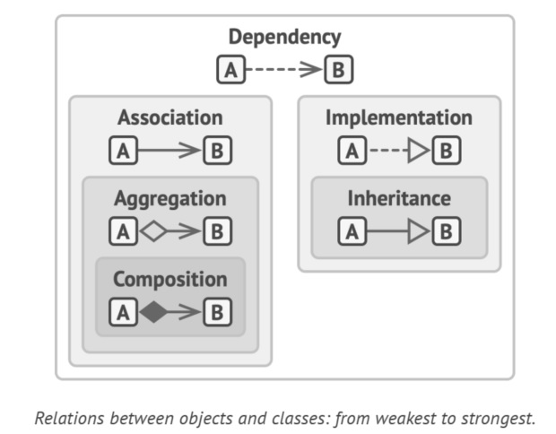

# Software design principles
Before going deep on design patterns, lets discuss the process of designing software architecture.

## Code reuse
Is one of the most common ways to reduce development costs. 

Making existing code work in a new context usually takes extra effort. You should avoid tight coupling between components, dependencies on concrete classes instead of interfaces, hard-coded operations.

Three levels of reuse:
- **Lowest level**: Classes
   - You reuse libraries, container and maybe some class "teams" like container/iterator.

- **Middle level**: Patterns
   - Smaller and more abstract that frameworks. They're a description about how a couple of classes can relate to and interact with each other.

- **High level**: Frameworks
   - They identify the key abstractions for solving a problem, represent them by classes and define relationships between them. 
   - Lets you define custom behavior and it will call you when it's your turn to do something.

What is good about the middle layer is that offers reuse but less risk. Building a framework is high-risk and a significant investment. Patterns let you reuse design ideas and concepts independently of concrete code.


# Design patterns

## What's a Design Pattern?
Are solutions to commonly occurring problems in software design. They are like pre-made blueprints that you can customize to solve a recurring design problem in your code.

The pattern is not an specific piece of code, but a general concept. You can follow the pattern details and implement a solution that suits the realities of your own program.

## What does the patter consist of?
- **Intent** of the patter briefly describes both the problem and the solution.
- **Motivation** further explains the problem and the solution the pattern makes possible.
- **Structure** of classes shows each part of the pattern and how they are related.
- **Code example** in one or more programming languages.

## Classification of patterns
Design patterns differ by their complexity, level of detail and scale of applicability to the entire system being designed.

- The most basic and low-level patterns are called *idioms* and they usually apply only to a  single programming language.

- The most universal and high-level patterns are called *architectural patterns*. These patterns can implement these patterns in virtually any language.

We can divide patterns in three groups:
- **Creational patterns** provide object creation mechanisms that increase flexibility and reuse of existing code.
- **Structural patterns** explain how to assemble objects and classes into larger structures, while keeping the structures flexible and efficient.
- **Behavioral patterns** take care of effective communication and the assignment of responsibilities between objects.

# Design principles

## Encapsulate what varies

> **Identify the aspects of your application that vary and separate them from what stays the same.**

The goal of this principle is to minimize the effect caused by changes. You can isolate parts of the program that vary in independent modules, protecting the rest of the code from adverse effects.

### Encapsulation on a method level
Imagine you're making an e-commerce website. And you implement a `getOrderTotal` method that calculates a grand total for the order, including taxes.

We can anticipate that tax-related code might need to change in the future. Overtime, the actual formula for tax calculation may change due to new laws or regulations. As a result, you'll need to change the `getOrderTotal` method quite often. But even the method's name suggests that it doesn't care about *how* taxes are calculated:

```
class Commerce 
{
    public:
        float getOrderTotal(Order& order)
        {
            float total = 0;
            float totalPreTax = order.sumAllProducts();
            
            if("EEUU" == order.country())
            {
                total = totalPreTax * 1.07;
            }
            else if ("EU" == order.country())
            {
                total = totalPreTax * 1.20;
            }
            else
            {
               total = totalPreTax;
            }
                
            return total;
        }
};

// Tax calculation is mixed with the rest of the method's code
```
You can extract the tax calculation logic into a separated method, hiding it from the original one:
```
class Commerce 
{
    public:
        float addTax(float preTaxValue, Order& order)
        {
            if("EEUU" == order.country())
            {
                total = totalPreTax * 1.07;
            }
            else if ("EU" == order.country())
            {
                total = totalPreTax * 1.20;
            }
            else
            {
                total = totalPreTax;    
            }
                
            return total;    
        }
        
        float getOrderTotal(Order& order)
        {
            float totalPreTax = order.sumAllProducts();
            
            return addTax(totalPreTax, order);
        }
};

// You can get the tax rate by calling a designation method.
```
> NOTE: see that we respect the [ROV](https://shaharmike.com/cpp/rvo/)

Tax-related changes become isolated inside a single method. Moreover, if the tax calculation logic becomes too complicated, it's now easier to move it to a separated class.

### Encapsulation on a class level
Over time you add more and more responsibilities to a method which used to do a simple thing. And this added behaviors eventually blur the primary responsibility of the containing class. Extracting everything to a new class might make things much more clear and simple.

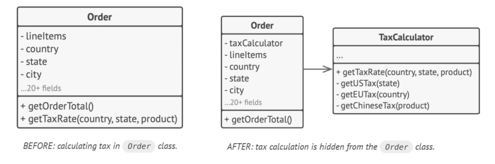

## Program to an interface, not an implementation
You can tell that the design is flexible enough if you can easily extend it without breaking any existing code. A `Cat` that can eat any food is more flexible that one that can eat just sausages.

When you want to make two classes collaborate, you can start by making one of them dependent on the other, but a more flexible way is to set up collaboration between objects:
1. Determine what exactly one object needs from the other (Which methods does it execute?).
2. Describe these methods in a new interface or abstract class.
3. Make the class that is a dependency implement this interface.
4. Make the second class dependent on this interface rather than on the concrete class. You can make it work with objects of the original class, but the connection is now much more flexible.

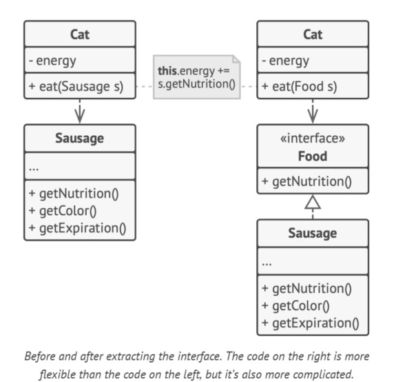

At first glance it seems that you only created a more complicated code, but when you or someone wants do add more functionality, this will come in handy.

### Example
Say you created a *software development company simulator*. You have different classes that represent various employee types:

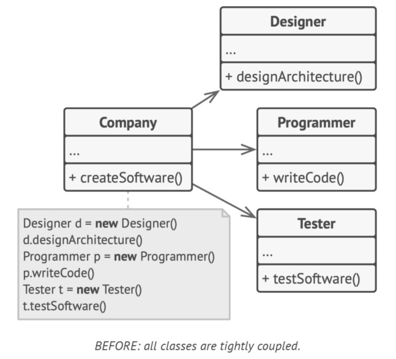

The `Company` class is tightly coupled to a concrete class of employees. Despite the difference in their implementation, we can generalize various work-related methods and extract a common interface for all employee classes.

Also, we can apply polymorphism inside the `Company` class, treating various employee objects via the `Employee` interface:

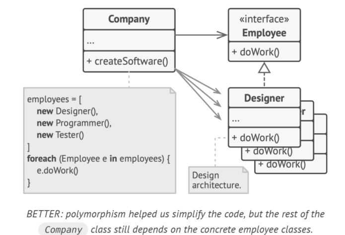

The `Company` class remains coupled to the employee classes. This is bad, if we introduce new types of companies that work with other types of employees, we'll need to override most of the `Company` class instead of reusing code.

To solve this problem, we declare the method for getting employees as *abstract*. Each company will implement this method differently, creating only those employees that it needs.
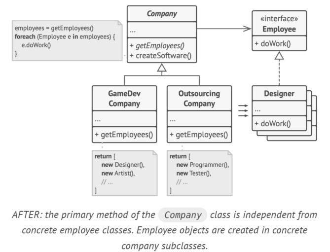

Now, the `Company` class become independent from various employee classes and can extend this class to introduce new types of companies and employees while still reusing a portion of the base company class. Extending the base company doesn't break any existing code that already relies on it.

> NOTE: This is a pattern! Refereed as [Factory method](https://refactoring.guru/design-patterns/factory-method) (more on that latter).

## Composition over inheritance
Inheritance is the most obvious and easy way of reusing code between classes. You have two classes with the same code, create a common base class for those two and move the similar code into it.

Unfortunately, inheritance comes with caveats that become apparent when you program has tons of classes:

- **A subclass can't reduce the interface of a supperclass**:
   - You have yo implement all abstract methods of the parent class, even if you won't use them.
- **When overriding methods you need to make sure that the new behavior is compatible with the base one**:
   - Objects of the subclass may be passed to any code that expects objects of the superclass and you don't want that code to break.
- **Inheritance breaks encapsulation of the superclass**:
   - Internal details of the parent class become available to the subclass.
- **Subclasses are tightly coupled to superclasses**:
   - Any change in a superclass may break the functionality of subclasses.
- **Trying to reuse code through inheritance can lead to creating parallel inheritance hierarchies**:
   - Inheritance usually takes place in a single dimension. But when there are two or more dimensions, you have to create lots of class combinations, bloating the class hierarchy.

An alternative to *inheritance* is *composition*.
   - Inheritance represent the "is a" of a relationship (a car *is a* transport).
   - Composition represent the "has a" of a relationship (a car *has an* engine).

> NOTE: this principle also applies to aggregation.

### Example
You need to create a catalog app for a car manufacturer. The company makes both cars and trucks; they can be either electrical or gas; all models have either manual control or autopilot.


Each additional parameter results in multiplying the number of subclasses. There's a lot of duplicated code between subclasses, because you can't extend two classes at the same time.

With composition, instead of a car objects implementing a behavior on their own, they can delegate it to other objects.

The added benefit is that you can replace a behavior at runtime. You can replace an engine object linked to a car object just by assigning a different engine object to the car.

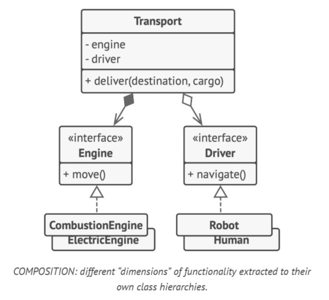

> NOTE: this structure of classes resembles the [Strategy pattern](https://refactoring.guru/design-patterns/strategy).

## SOLID principle
As all things in life, don't take things as a dogma. This principles are not always respected, even in successful software products, but is good to think of them whenever you write code.

SOLID is a mnemonic for five design principles, intended to make software design more understandable, flexible and maintainable.

### Single responsibility principle
> A class should have one reason to change

Try to make every class responsible for a single part of the functionality provided by the software, and make that responsibility entirely encapsulated (*hidden within*) by the class.

If a class does too many things, you have to change it every time one of these things change. While doing this you are risking other parts of the class which you didn't intend to change.

#### Example
The `Employee` class has several reasons to change. One might be related to the main job of the class, that is *managing employee data*. Another reason is that the format of the *timeSheet* may change, requiring you to change the code withing the class.

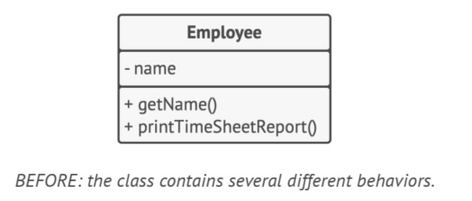

Solve the problem by moving the behavior related to printing timesheet reports into a separated class.

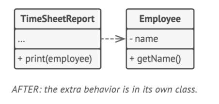

### Open / Closed principle
> Classes should be open for extension but closed for modification.

The idea of this principle is to keep existing code from breaking when you implement new features.

A class is *open* if you can extend it, produce a subclass and do whatever you want with it (add new methods or fields, override base behavior, etc).

After this, the class is *closed* if it's 100% ready to be used by other classes (the interface is clearly defined and won't change).

If a class is already developed, tested and reviewed, changing its code is risky. Instead, you can create a subclass that overrides parts of the original that you want to behave differently.

> NOTE: obviously if there is a bug, go and fix it. Child classes shouldn't be responsible for the parent's issue.

#### Example

You have an e-commerce app with an `Order` class that calculates shipping costs and all shipping methods are hardcoded inside the class. If you need to add a new shipping  method, you have to change the code of the `Order` class and risk breaking it.

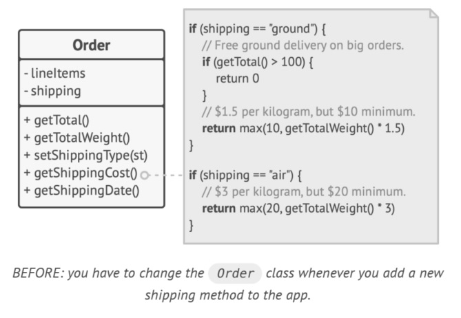

You can solve the problem by applying the [*Strategy pattern*](https://refactoring.guru/design-patterns/strategy). Start by extracting shipping methods into separate classes with common interface.

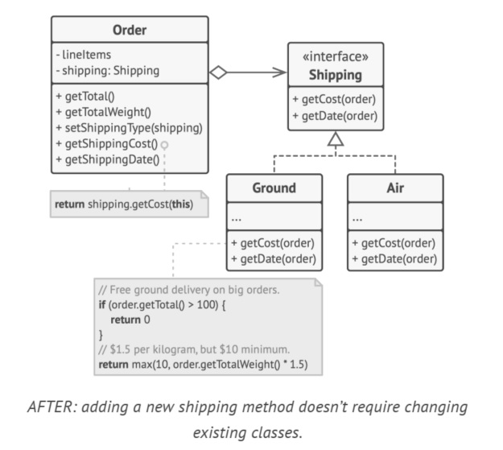

Now, when you implement a new shipping method, you can derive new class from the `Shipping` interface without touching any of the code in the `Order` class.

As a bonus, this solution let you move the delivery time calculation to more relevant classes, according to the [*single responsibility principle*](#single-responsibility-principle).

### Liskow substitution principle
> When extending a class, remember that you should be able to pass objects of the subclass in place of objects of the parent class without breaking the client code.

This means that the subclass should remain compatible with the behavior of the superclass. When overriding a method, extend the base behavior instead of replacing it with something else.

This principle is a set of checks that help predict whether a subclass remains compatible with the code that was working with the superclass. This is critical when developing libraries and frameworks, because your classes are going to be used by other people whose code you can't directly access and change.

#### Checklist
- Parameter types in a method of a subclass should *match* or be *more abstract* than parameter types in the method of the supperclass:
   - There's a class with a method that's supposed to feed cats `feed(Cat c)`. Client code always passes cat objects into this method.
      - **GOOD**: You create a subclass that overrode the method so that it can feed any animal (a supperclass of cats): `feed(Animal c)`. Now if you pass an object to the client code, everything would still work. The method can feed all animals, so it can still feed any cat passed by the client.
      - **BAD**: You create another subclass and restricted the feeding method to only accept Bengal cats (a subclass if cats): `feed(BengalCat c)`. What will happen to the client code if oy link it with an object like this instead of with the original class? Since the method can only feed a specific breed of cats, it won't serve generic cats passed by the client, breaking all related functionality.

- The return type in a method of a subclass should *match* or be a *subtype* of the return type in the method of the superclass (requirements for a return type are inverse of requirements for parameter types):
   - You have a class with a method `Cat butCat();`. The client code expects to receive any cat as result of executing this method.
      - **GOOD**: A subclass overrides the method as follows: `BengalCat buyCat();`. The client gets a Bengal cat, which still is a cat, so everything okay.
      - **BAD**: A subclass overrides the method as follows: `Animal butCat();`. Now the client code breaks since it receives an unknown generic animal, that doesn't for a structure designed for a cat.

- A method in a subclass shouldn't throw types of exceptions which the base method isn't expected to throw:
    - Types of exceptions should *match* or be *subtypes* of the ones that the base method is already able to throw. This is because `try-catch` blocks in the client code target specific types and unexpected types might slip throw the defensive lines of the client code and crash the application.

- A subclass shouldn't strengthen pre-conditions:
    - If the base method has a parameter with type `int`. If a subclass limits the value of the argument to just positive numbers (by throwing an exception), then the client code, which used to work fine when passing negative numbers into the method, now breaks if starts working with an object of this subclass.

- A subclass shouldn't weaken post-conditions:
    - You have a class with a method that works with a DB. A method of the class is supposed to always close all opened DB connections upon return a value.
    - If you create a subclass that leaves open the connection to reuse it. But the client might now know about that and terminate the program without cleanly closing it, leaving behind ghost DB connections.

#### Example
Here is a hierarchy of document classes that violates the substitution principle:

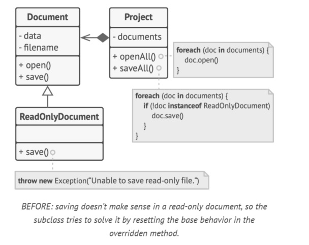

The `save` method in the `ReadOnlyDocument` subclass thrown an exception if someone tries to call it. The base method doesn't have this restriction. This means that the client code will break if we don't check the document type before saving it. 

The resulting code also violates the open/closed principle, since the code becomes dependent on concrete classes of documents. If you introduce a new document subclass, you'll need to change the client code to support it.

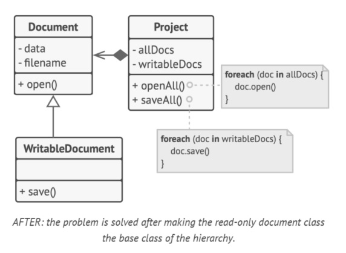

You can solve the problem by redesigning the class hierarchy. A subclass should extend the behavior of a superclass, therefore the read-only document becomes the base class of the hierarchy. The writable document is now a subclass which extends the base class and adds the saving behavior.

### Interface segregation principle
> Clients shouldn't be forced to depend on methods they do not use.

Try to make your interfaces narrow enough that client  classes don't have to implement behaviors they don't need.

You should break down "fat" interfaces into more granular and specific ones. Clients should only implement methods that they really need. Class inheritance lets a class have just one superclass, but it doesn't limit the number of interfaces that the class can implement, so there is no need to add lots of unrelated methods to a single interface (break them down into more refined interfaces, you can implement them all in a single class if needed).

#### Example
You create a library that makes it easy to integrate apps with various cloud computing providers. While the initial version only supported AWS, it covered the full set of cloud services and features.

You assumed all cloud providers have the same spectrum of features as AWS, but it turned out that most of the interfaces of the library are too wide. Some methods describe features that other cloud providers just don't have:

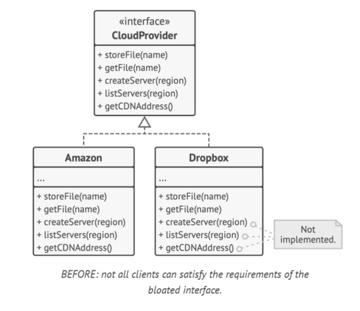

You can implement these methods and put nullify some methods, but its not elegant. The better approach is to break down the interface into parts. Classes that are able to implement the original interface can just implement several refined interfaces. Other classes can implement only those interfaces wich have methods that make sense for them:

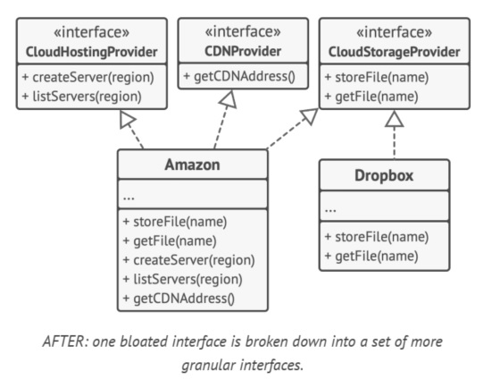

Remember (as with the other principles) don't go too far. More interfaces mean more complex code, keep a balance.

### Dependency Inversion Principle
> High-level classes shouldn't depend on low-level classes. Both should depend on abstraction. Abstraction shouldn't depend on details. Details should depend on abstraction.

When designing software, you can make a distinction between two levels of classes:
- **Low-level classes**: implement basic operations such as working with a disk, transferring data over a network, connection to a DB, etc.
- **High-level classes**: Contain complex business logic that directs low-level classes to do something.

Sometimes you design low-level classes first and then start on the high-level ones. This is common when you start to develop a prototype and you're not sure what's possible at the higher level because low-level stuff isn't yet implemented or clear. With this approach, business logic classes tend to become dependent on primitive low-level classes.

This principle suggest changing the direction of this dependency:
1. Describe the **interface** for low-level operations that high-level classes rely on, preferably in business terms. 
    - Example: The business logic should call a method `openReport(file)` rather than a series of methods `openFile(x)`, `readBytes(n)`, `closeFile(x)`. These interfaces count as high-level ones.
2. Make the high-level classes dependent on those interfaces, instead of on concrete low-level classes.
3. Once low-level classes implement these interfaces, they become dependent on the business logic level, reserving the direction of the original dependency.

This principle often goes along with the *open/closed*: you can extend low-level classes to use with different business logic classes without breaking existing classes.

#### Example
The high-level budget reporting class uses a low-level DB class for reading and persisting its data. Any change in the low-level class, such as when a new version of the DB gets released, may affect the high-level class, which isn't supposed to care about the data storage details.

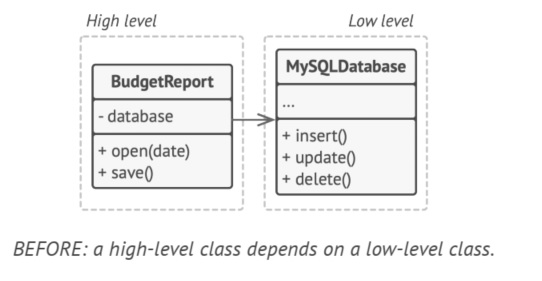

You can fix this problem by creating a high-level interface that describes read/write operations and making the reporting class use that interface instead of the low-level class. Then you can change or extend the original low-level class to implement the new read/write interface declared by the business logic:

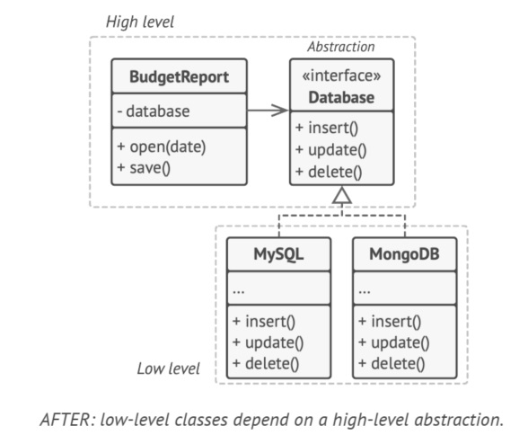

The direction of the original dependency has been inverted: low-level classes are now depended on the high-level abstraction.

# Catalog of design patterns
For this part the summary will contain the following:
- Problem to solve.
- Structure to solve it.
- C++ implementation.
- Use cases.
- Pros and cons.
- Relation with other patterns.

## Creational Design patterns
They provide various object creation mechanism which increase flexibility and reuse of existing code.

- **[Factory method](#factory-method)**: Provides an interface for creating objects in superclass, but allows subclasses to alter the type of objects that will be created.

- **[Abstract factory](#abstract-factory)**:  Produce families of related objects without specifying their concrete classes.

- **[Builder](#builder)**: Construct complex objects step by step. The pattern allows you to produce different types and representations of an object using the same construction code.

- **[Prototype](#prototype)**: Lets you copy existing objects without making your code dependent on their classes.

- **[Singleton](#singleton)**: Lets you ensure that a class has only one instance, while providing a global access point to the instance.

## Structural design patterns

- **[Adapter](https://refactoring.guru/design-patterns/adapter/cpp/example)** Allows objects with incompatible interfaces to collaborate.

- **[Bridge](https://refactoring.guru/design-patterns/bridge/cpp/example)** Lets you split a large class or a set of closely related classes into two separate hierarchies—abstraction and implementation—which can be developed independently of each other.

- **[Composite](https://refactoring.guru/design-patterns/composite/cpp/example)** Lets you compose objects into tree structures and then work with these structures as if they were individual objects.

- **[Decorator](https://refactoring.guru/design-patterns/decorator/cpp/example)** Lets you attach new behaviors to objects by placing these objects inside special wrapper objects that contain the behaviors.

- **[Facade](https://refactoring.guru/design-patterns/facade/cpp/example)** Provides a simplified interface to a library, a framework, or any other complex set of classes.

- **[Flyweight](https://refactoring.guru/design-patterns/flyweight/cpp/example)** Lets you fit more 
objects into the available amount of RAM by sharing common parts of state between multiple objects instead of keeping all of the data in each object.

- **[Proxy](https://refactoring.guru/design-patterns/proxy/cpp/example)** Lets you provide a substitute or placeholder for another object. A proxy controls access to the original object, allowing you to perform something either before or after the request gets through to the original object.

## Behavioral design patterns
Behavioral design patterns are concerned with algorithms and
the assignment of responsibilities between objects.

- **[Chain of responsibility](https://refactoring.guru/design-patterns/chain-of-responsibility/cpp/example)** Lets you pass requests along a chain of handlers. Upon receiving a request, each handler decides either to process the request or to pass it to the next handler in the chain.

- **[Command](https://refactoring.guru/design-patterns/command/cpp/example)** Turns a request into a stand-alone object that contains all information about the request. This transformation lets you pass requests as a method arguments, delay or queue a request's execution, and support undoable operations.

- **[Iterator](https://refactoring.guru/design-patterns/iterator/cpp/example)** Lets you traverse elements of a collection without exposing its underlying representation (list, stack, tree, etc.).

- **[Mediator](https://refactoring.guru/design-patterns/mediator/cpp/example)** Lets you reduce chaotic dependencies between objects. The pattern restricts direct communications between the objects and forces them to collaborate only via a mediator object.

- **[Memento](https://refactoring.guru/design-patterns/memento/cpp/example)** Lets you save and restore the previous state of an object without revealing the details of its implementation.

- **[Observer](https://refactoring.guru/design-patterns/observer/cpp/example)** Lets you define a subscription mechanism to notify multiple objects about any events that happen to the object 
they're observing.

- **[State](https://refactoring.guru/design-patterns/state/cpp/example)** Lets an object alter its behavior when its internal state changes. It appears as if the object changed its class.

- **[Strategy](https://refactoring.guru/design-patterns/strategy/cpp/example)** Lets you define a family of algorithms, put each of them into a separate class, and make their objects interchangeable.

- **[Template Method](https://refactoring.guru/design-patterns/template-method/cpp/example)** Defines the skeleton of an algorithm in the superclass but lets subclasses override specific steps of the 
algorithm without changing its structure.

- **[Visitor](https://refactoring.guru/design-patterns/visitor/cpp/example)** Lets you separate algorithms from the objects on which they operate.