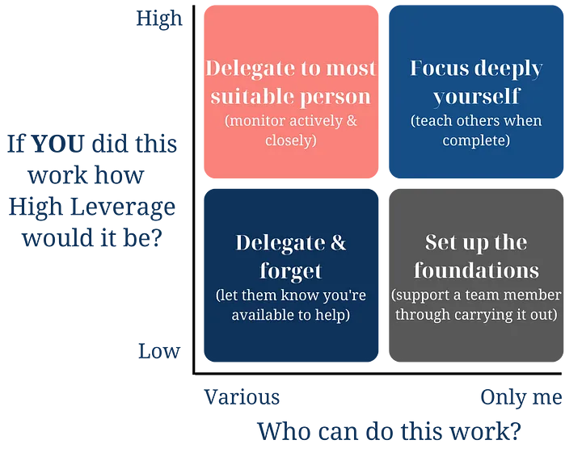

# Management notes

Some important factors that improve the relation manager-team. I will address this from the manager's perspective:
- Schedule one-on-ones, keep them on the same day and time, and never cancel them.
	- Look for a good moment in the week (talk to your team members and schedule based on that). My take as a team member is that Mondays are not a good day for one-on-ones.

## Questions
There are many questions you must ask yourself and your team, and every question has its scope and meaning.

- Where do you need help?
This should be asked in interviews and also to the team members when we reach a certain level of confidence. Most important is that this question must be answered by yourself!

## Types of team leaders
Product teams often have an **Engineering Manager**, a **Product Manager**, and sometimes an **Engineering Lead**.

Each type has its responsibilities and ownership:
- *Product Manager* (PM): Owns the story of "what"
	- Translating company goals into the Roadmap.
	- Acting as a communication conduit to the product and the broader organization.
	- Understanding customer needs and producing customer insight.  
- *Engineering Leader* (EL): Owns the story of "how"
	- Technical mentor-ship.
	- Surfacing major architecture changes to engineering leaders.
	- Translating the "why" for a project to "how" (e.g. architecture decisions, product health).
	- Identifying technical risks.
- *Engineering Manager* (EM): Owns the story of "who"
	- Coaching developer's career paths and personal growth.
	- Recruiting and owning the team's interview workflow.
	- Delivering annual performance reviews.
	- Monitoring team health.

Of course, these roles overlap:

For example, the **PM** and **EL** overlap in *scoping and estimating the project work for the team*. And some examples where all three overlap:
- Defining and improving team processes (standup's, etc.).
- Delivering feedback to teammates.
- Communicating with stakeholders.
- Determining team hiring needs, as each person provides input from a different point of view.
- Ensuring the team is hitting key results.
- Identify execution roadblocks early and solve them. 

## The art of delegation

### What should you delegate?
As much as possible. Design yourself completely out of your job. Consider the following example:

There is some work that you need to complete in the next 2 weeks:
- How impactful is this work?
- Who can do it?
- Who would like to or is capable of learning to do this? (If there is no one suitable to delegate to at the moment)
- How will you share your learning to increase the number of people who can do this work?

### Delegate goals not tasks
Delegating tasks is relatively easy, "Please do x by y time". 

But it's not going to make you great at delegating, or connecting people to the impact of their work (this is critical).

You have to give people **the goal** and **the why** (why is this important? What does it mean for the team or company?).

### Set expectation with your own manager
The most important part of delegation is not *how you focus on your team* but how you justify that focus. So show your manager that:
- The must-do's will be handled well.
- You'll be stretching and testing your team.
- You're working where you expect mistakes might happen.
- You plan to handle anything that breaks.

### Set expectations with yourself
Your team will not do things the same way you do. So you have a choice:
- Waste a ton of time trying to make them do it your way.
- Harness their new perspective and enthusiasm to do it better. 

> 5 people doing 80% as well as you did is 400%

Be honest with yourself:
- If you have to hang onto something, do it.
- Question delegating a miserable task if you feel guilty.
- If you can't delegate them anything, you have a bigger problem.

### Delegate for your development
The only way you'll grow into a bigger role is by having space for your own development. Your initial delegation prioritization should be:
1. Anything partially delegated ➡️ Completion achieves clarity, so make it happen.
2. Where you add the least value ➡️ Your repetitive work is their growth.
3. The routine ➡️ Ripe for a playbook or automation, help your team own this.

Turn this into action. Look back at that task list and also your calendar:
- What goals and tasks should you delegate and what should you keep?
- Whom could you delegate to, who is best suited?
- What touch points or support will they need, and can you bookmark time?
- Schedule time to share learning experiences after projects or key work to keep that virtuous cycle.

### Delegate for their development
Time to focus on the stretch each employee needs to excel:
- Are they new to a role or the company? Be more directive.
- Are they established and growing? Ask them how they would solve the problem.
- Are they an expert? Challenge them to find new problems to solve and get out the way

#### Everyday practical tip
Ask them how they would approach solving a problem, the steps they would take, and challenge them, using a coaching approach. Get them to work out how to solve problems by themselves. Check in at 20% and 80% completion.

#### Longer term practical tip
Ask them how they want to grow (people usually know). And they'll feel agency over their own development. Challenge them to go out and find and take that work, but be there to support them. Virtuous cycle.

### Set expectations with your team
Good delegation is more than assigning tasks: **It's goal-oriented, it's written down, it's intentional.**

### Work on the mechanics
You've already:
- Defined your goals for your team.
- Given the resources they need (time, money, whatever).
- Aligned on success, so they know what great looks like.

Now, start climbing:
- Steps over Tasks, ensure they can enunciate them.
- Processes over Steps, how does this change our long term approach.
- Responsibilities over Processes, level them up to take responsibility.
- Goals over Responsibilities, ensure they have the context for the goals
- Outcomes over Goals, focus on the outcomes

Each run is higher leverage!

### Watch out for: delegating and walking away
You need to trust your team to do great work. But you also need to verify that it's been done, **and done well.** You also have to support their efforts. Clear metrics and surveys / feedback are a good starting point, as are quick and simple retrospectives. 

Simple questions:
- What would you do differently next time? Get them to explain.
- What could I do to better support you when delegating? Get them to be frank.

Checking in is not Micromanaging, that's different, that's your insecurity. Your job is to enable, motivate and assess the various paths. If they're being defensive when you keep asking for updates, that ones on you buddy!
