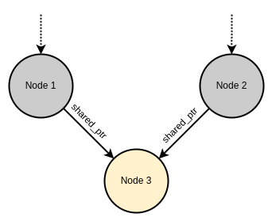

# Table of contents

- [Notes about C++](#notes-about-c)
  - [The standard C++ library](#the-standard-c-library)
    - [Strings](#strings)
      - [What's in a string?](#whats-in-a-string)
        - [Creating and initializing](#creating-and-initializing)
        - [Initialization limitations](#initialization-limitations)
      - [Operating on strings](#operating-on-strings)
      - [Replacing string characters](#replacing-string-characters)
      - [Simple character replacement using the STL replace() algorithm](#simple-character-replacement-using-the-stl-replace-algorithm)
      - [Concatenation using non-member overloaded operators](#concatenation-using-non-member-overloaded-operators)
    - [Searching in strings](#searching-in-strings)
- [Iostream](#iostream)
  - [True wrapping](#true-wrapping)
  - [Iostreams to the rescue](#iostreams-to-the-rescue)
  - [Static](#static)
    - [Static Variables](#static-variables)
      - [Initialization of Static Variables](#initialization-of-static-variables)
        - [Two stages of static variable initialization](#two-stages-of-static-variable-initialization)
      - [The green Zone - Constant initialization](#the-green-zone---constant-initialization)
        - [Force Const Initialization - *constexpr*](#force-const-initialization---constexpr)
        - [Your Second Line of Defense - *constinit*](#your-second-line-of-defense---constinit)
      - [The Yellow Zone - Dynamic Initialization](#the-yellow-zone---dynamic-initialization)
      - [The Red Zone - Static Initialization Order Fiasco](#the-red-zone---static-initialization-order-fiasco)
        - [Solving The Static Initialization Order Fiasco](#solving-the-static-initialization-order-fiasco)
    - [Summary](#summary)
    - [Static methods](#static-methods)
- [Casting](#casting)
  - [Dynamic casting](#dynamic-casting)
- [Exception handling](#exception-handling)
- [Optimizations](#optimizations)
  - [++prefix forms are preferred against postfix++](#prefix-forms-are-preferred-against-postfix)
  - [Return Value Optimization (RVO)](#return-value-optimization-rvo)
  - [Name Return Value Optimization (NRVO)](#name-return-value-optimization-nrvo)
- [Test Driven Development (TDD)](#test-driven-development-tdd)
  - [The Soundex Class](#the-soundex-class)
    - [Getting started](#getting-started)

# Notes about C++

## The stack and the heap
C++ has several types of memories that correspond to different parts of the physical memory:
- The static
- The stack
- The heap

### The stack
The default way to store objects in C++:
```
int f(int a)
{
    if (0 < a)
    {
        std::string s = "a positive number";
        std::cout << s << '\n';
    }
    return a;
}
```
Here **a** and **s** are stored (pushed) on the stack, also they are next to one another in memory, hence the name stack. The most important part is that **objects allocated on the stack are automatically destroyed when they go out of scope**.

The scope is defined by a pair of **{}**, except those used to initialize objects: 
```
std::vector<int> v = {1, 2, 3}; // this is not a scope

if (0 < v.size())
{ // this is the beginning of a scope
    ...
} // this is the end of a scope
```
There are three ways for an objects to go out of scope:
- Encountering the next closing bracket **}**.
- Encountering a return statement.
- Having an exception thrown inside the current scope that is not caught inside the current scope.

### The heap
The heap is where dynamically allocated objects are stored, that is to say **objects that are allocated with a call to new**, which returns a pointer. In reality the heap is the memory allocated by **malloc**, **calloc** and **realloc**, and new stores it in the **free store** (but the term is used anyways).

Objects stored on the heap are **not destroyed automatically** but when **delete** is called. This offers the advantage of keeping them longer than then end of a scope, and without incurring any copy except those of pointers (which are cheap). 

> NOTE: Pointers allow to manipulate objects polymorphically. A pointer to a base class can point to objects of any derived class.

The price for this flexibility is that the developer is in charge of the deletion on this objects also called deallocation. Deleting an object on the heap is not trivial, because delete has to be called **once and only once**, doing so leads to *undefined behavior*. If the memory is not deallocated, then this memory space is not reusable, this is called a *memory leak*.

As you can see, this is a problem. Latter we will see the concept of [smart pointers](#smart-pointers) which will help us on this task.

## Function pointers
A way to assign a function to a variable.

## Lambdas
Whenever you have a function pointer, you can instead use a lambda, but without defining a function.


## The standard C++ library
The standard C++ library incorporates all the Standard C libraries, with additions and changes to support type safety and also adds libraries.

### Strings
The C++ **string** class solves the problem of array manipulation, keeping track of memory even during assignments and copy-constructions.

#### What's in a string?

In C, a string is an array of character that always includes a binary zero (*null terminator*) as its final array element. The main differences between C++ **strings** and their C counterparts are:
- **String** objects associate the array of characters which constitute the **string** with methods useful for managing and operating on it.
- **String** objects know the data starting location in memory, its content, length in characters and length in characters before the internal data buffer needs a resize.
- **String** objects do not include a *null terminator*. 
This reduces the like-hood of the three most common and destructive C programming errors: 
- Overwriting array bounds.
- Trying to access arrays throughout uninitialized or incorrectly valued pointers.
- Leaving pointers "dangling" after an array ceases to occupy the storage that was once allocated to it.

##### Creating and initializing
The **string** class lets you:
- Create an empty **string** and defer initializing it with character data.
- Initialize a **string** by passing a literal, quoted character array as an argument to the constructor.
- Initialize a **string** using '='.
- Use one **string** to initialize another.
```
#include <string>
int main() 
{
 std::string imBlank;
 std::string heyMom("Where are my socks?");
 std::string standardReply = "Beamed into deep " "space on wide angle dispersion?";
 std::string useThisOneAgain(standardReply);
}
```
These are the simplest forms of string initialization, but there are other variations which offer more flexibility and control. You can:
- Use a portion of either a C **char** array or a C++ **string** .
- Combine different sources of initialization data using **operator+**.
- Use the **string** object's **substr()** member function to create a substring.
```
#include <string>
#include <iostream>
int main() 
{
  std::string s1("What is the sound of one clam napping?");
  std::string s2("Anything worth doing is worth overdoing.");
  std::string s3("I saw Elvis in a UFO.");

  // Copy the first 8 chars
  std::string s4(s1, 0, 8);

  // Copy 6 chars from the middle of the source
  std::string s5(s2, 15, 6);

  // Copy from middle to end
  std::string s6(s3, 6, 15);

  // Copy all sorts of stuff
  std::string quoteMe = s4 + "that" +
 
  // substr() copies 10 chars at element 20
  s1.substr(20, 10) + s5 +
  
  // substr() copies up to either 100 char or 'end of string' starting at element 5
  "with" + s3.substr(5, 100) +
  
  // OK to copy a single char this way
  s1.substr(37, 1);
  
  std::cout << quoteMe << std::endl;
}
```
- The **string** member function **substr()** takes a starting position as its first argument and the number of characters to select as the second argument. Both of these arguments have default values and if you say **substr()** with an empty argument list you produce a copy of the entire **string**, so this is a convenient way to duplicate a **string**.

> Output: "What is that one clam doing with Elvis in a UFO.?" 

Notice the final line of example above. C++ allows **string** initialization techniques to be mixed in a single statement, a flexible and convenient feature. Also note that the last initializer copies just one character from the source **string**. 

Another slightly more subtle initialization technique involves the use of the **string** iterators **string.begin()** and **string.end()**. This treats a string like a container object which has iterators indicating the start and end of the “container.” This way you can hand a **string** constructor two iterators and it will copy from one to the other into the new **string**: 
```
#include <string>
#include <iostream>
int main() 
{
 std::string source("xxx");
 std::string s(source.begin(), source.end());
 std::cout << s << std::endl;
}
```
The iterators are not restricted to **begin()** and **end()**, so you can choose a subset of characters from the source string. 

##### Initialization limitations
**strings** may not be initialized with a single character or with ASCCI or other integer value:
```
#include <string>
int main() 
{
 // Error: no single char inits
 std::string nothingDoing1('a');
 // Error: no integer inits
 std::string nothingDoing2(0x37);
}
```
This is true both for initialization by assignment and by copy constructor. 

#### Operating on strings
Strings grow as needed, without intervention on the part of the programmer. This makes string handling inherently more trustworthy. For example, the **string** function member functions **append()** and **insert()** transparently reallocate storage when the string grows:
```
#include <string>
#include <iostream>
int main() 
{
 std::string bigNews("I saw Elvis in a UFO. ");
 std::cout << bigNews << std::endl;
 
 // How much data have we actually got?
 std::cout << "Size = " << bigNews.size() << std::endl;
 
 // How much can we store without reallocating
 std::cout << "Capacity = " << bigNews.capacity() << std::endl;

 // Insert this string in bigNews immediately
 // before bigNews[1]
 bigNews.insert(1, " thought I ");
 
 std::cout << bigNews << std::endl; 

 std::cout << "Size = " << bigNews.size() << std::endl;
 std::cout << "Capacity = " << bigNews.capacity() << std::endl;
 
 // Make sure that there will be this much space
 bigNews.reserve(500);
 
 // Add this to the end of the string
 bigNews.append("I've been working too hard.");
 std::cout << bigNews << std::endl;
 std::cout << "Size = " << bigNews.size() << std::endl;
 std::cout << "Capacity = " << bigNews.capacity() << std::endl;
}
```
> Output: \
I saw Elvis in a UFO. \
Size = 22 \
Capacity = 22 \
I thought I  saw Elvis in a UFO. \
Size = 33 \
Capacity = 44 \
I thought I  saw Elvis in a UFO. I've been working too hard. \
Size = 60 \
Capacity = 500 

The **size()**, **resize()**, **capacity()** and **reserve()** member functions can be very useful when its necessary to work back and forth between data contained in C++ style strings and traditional null terminated **char** arrays.

#### Replacing string characters
**insert()** is nice because it makes sure the insertion of character in a string won't overrun the storage capacity. 

**replace()** is useful if you need to replace a part of a string or make it smaller while retaining the same set of characters. It has a number of overloads but the simplest takes three arguments: an integer (where to start the replace), an integer (how many character to eliminate) and the replacement string (can be a different number of characters than the eliminated quantity).

```
#include <string>
#include <iostream>
int main() 
{
 std::string s("A piece of text");
 std::string tag("$tag$");
 s.insert(8, tag + ' ');
 std::cout << s << std::endl;
 
 int start = s.find(tag);
 std::cout << "start = " << start << std::endl;
 std::cout << "size = " << tag.size() << std::endl;
 
 s.replace(start, tag.size(), "hello there");
 std::cout << s << std::endl;
} 
```
The previous example replaces with a **char\***, but there's an overloaded version that replaces with a **string**.

You should check to see if you've found anything before you perform a **replace()**. Here is a more complete demonstration:

```
#include <string>
#include <iostream> 
void replaceChars(string& modifyMe,string findMe, string newChars)
{
 // Look in modifyMe for the "find string"
 // starting at position 0
 int i = modifyMe.find(findMe, 0);
 
 // Did we find the string to replace?
 if(i != string::npos)
    modifyMe.replace(i,newChars.size(),newChars); // Replace the find string with newChars
}

int main() 
{
 string bigNews = 
 "I thought I saw Elvis in a UFO. " 
 "I have been working too hard.";
 
 std::string replacement("wig");
 std::string findMe("UFO");
 
 // Find "UFO" in bigNews and overwrite it:
 replaceChars(bigNews, findMe, replacement);
 std::cout << bigNews << std::endl;
}
```
> Output: I thought I saw Elvis in a wig. I have been working too hard. 

If replace doesn't find the search string, it returns **npos**. **npos** is a static constant member of
the **basic_string** class. 

Unlike **insert()**, **replace()** won't grow the **string**'s storage space if you copy new character into the middle of an existing series of array elemnts. But it will grow the storage space if you make a "replacement" that writes beyond the end of an existing array;

```
#include <string>
#include <iostream>
int main() 
{
 std::string bigNews("I saw Elvis in a UFO. " "I have been working too hard.");
 std::string replacement("wig");
 
 // The first arg says "replace chars beyond the end of the existing string":
 bigNews.replace(bigNews.size(), replacement.size(), replacement);
 
 std::cout << bigNews << std::endl;
}
```
> Output: I saw Elvis in a UFO. I have been working too hard.wig 
Notice that **replace()** expands the array to accommodate the growth of the string due to “replacement” beyond the bounds of the existing array.


#### Simple character replacement using the STL replace() algorithm
The **string** class doesn't define a way to replace all the instances of a character with another. 


STL algorithms came in handy here, because an **string** class can look just like an STL container (STL algorithms work with anything that looks like an STL container). All the STL algorithms work on a "range" of elements within a container. Usually that range is just "from the beginning of the container to the end". 


A **string** object looks like a container of characters (from **string::begin()** to **string::end()**). The following example shows the use of STL **replace()** algorithm to replace all instances of 'X with 'Y'.

```
#include <string>
#include <algorithm>
#include <iostream>

int main() 
{
 std::string s("aaaXaaaXXaaXXXaXXXXaaa");
 std::cout << s << std::endl;
 replace(s.begin(), s.end(), 'X', 'Y');
 std::cout << s << std::endl;
} 
```
> output:
aaaXaaaXXaaXXXaXXXXaaa
aaaYaaaYYaaYYYaYYYYaaa

Notice that this **replace()** is not called as member function of **string**. Unlike **string::replace()** functions with only performs one replacement, STL replace is replacing all instances of one character with another.

Unlike **insert()**, **replace()** won't grow the **string**'s storage space if you copy new character into the middle of an existing array of elements. But, it will grow the storage space if you make a "replacement" that writes beyond the end of an existing array.

The STL **replace()** algorithm only works with single objects (in this case, **char** objects), and will not perform replacements of quoted **char** arrays or of **string** objects. 

Since a **string** looks like an STL container, there are a number of other STL algorithms that can be applied to it, which may solve other problems you have that are not directly addressed by the **string** member functions (More on STL latter).

#### Concatenation using non-member overloaded operators
C++ strings can be combined and appended using the **operator+** and **operator+=**:
```
#include <string>
#include <iostream>

int main() 
{
 std::string s1("This ");
 std::string s2("That ");
 std::string s3("The other ");
 
 // operator+ concatenates strings
 s1 = s1 + s2;
 std::cout << s1 << std::endl;

 // Another way to concatenates strings
 s1 += s3;
 std::cout << s1 << std::endl;
 
 // You can index the string on the right
 s1 += s3 + s3[4] + "oh lala";
 std::cout << s1 << std::endl;
}
```

> output:
This
This That
This That The other
This That The other ooh lala 

### Searching in strings 
The **find** family of **string** member functions allows you to locate a character or group of characters within a given string. Here are the members of the **find** family and their general usage: 


| string find member function  |                                                                                                      What/how it finds                                                                                                       |
|------------------------------|------------------------------------------------------------------------------------------------------------------------------------------------------------------------------------------------------------------------------|
| find()                       | Searches a string for a specified character or group of characters and returns the starting position of the first occurrence found or npos if no match is found. (npos is a const of –1 and indicates that a search failed.) |
| find_first_of()              | Searches a target string and returns the position of the first match of any character in a specified group. If no match is found, it returns npos.                                                                           |
| find_last_of()               | Searches a target string and returns the position of the last match of any character in a specified group. If no match is found, it returns npos.                                                                            |
| find_first_not_of()          | Searches a target string and returns the position of the first element that doesn’t match any character in a specified group. If no such element is found, it returns npos.                                                  |
| find_last_not_of()           | Searches a target string and returns the position of the element with the largest subscript that doesn’t match of any character in a specified group. If no such element is found, it returns npos.                          |
| rfind()                      | Searches a string from end to beginning for a specified character or group of characters and returns the starting position of the match if one is found. If no match is found, it returns npos                               |

# Iostream

Why use it?
One argument can be that is safer than its C counterpart. For example, you want to make sure a stdio file is always safely opened and properly closed, without relying on the user to remember to call **close()** function:

```
// FileClass.h

#ifndef FILECLAS_H
#define FILECLAS_H
#include <cstdio>

class FileClass 
{
  private:
    std::FILE* f;

  public:
    FileClass(const char* fname, const char* mode="r");
    ~FileClass();
    std::FILE* fp();
};
#endif // FILECLASS_H 
``` 

In C when you perform file I/O, you work with a naked pointer to a FILE struct, but this class wraps around the pointer and guarantees it is properly initialized and cleaned up using the constructor and destructor. The second constructor argument is the file mode, which defaults to “r” for “read.”

To fetch the value of the pointer to use in the file I/O functions, you use the **fp()** access function. Here are the member function definitions:
```
// FileClass.cpp

#include "FileClass.h"
#include <cstdlib>

FileClass::FileClass(const char* fname, const char* mode)
{
  f = fopen(fname, mode);
  if(f == NULL) 
  {
    printf("%s: file not found\n", fname);
    exit(1);
  }
}
FileClass::~FileClass() { fclose(f); }
FILE* FileClass::fp() { return f; }
```

The constructor calls **fopen()**,as you would normally do, but it also checks for failure upon opening the file. If there's a failure, the name
of the file is printed and **exit()** is called. The destructor closes the file, and the access function **fp()** returns f.

```
int main(int argc, char* argv[]) 
{
  FileClass f(argv[1]); // Opens and tests
  const int bsize = 100;
  char buf[bsize];
  
  while(fgets(buf, bsize, f.fp())) 
    puts(buf);
    
  // File automatically closed by destructor     
} 
```
You create the FileClass object and use it in normal C file I/O function calls by calling **fp()**. When you're done with it, just forget about it, and the file is closed by the destructor at the end of the scope. 

file:///home/sebas/Documents/Mega/Estudio/Bibliografia/Bibliografia%20General/Programming/C++/Thinking%20in%20C++.pdf
68

## True wrapping
Even though the FILE pointer is private, it isn't particularly safe because **fp()** retrieves it. The only effect seems to be guaranteed initialization and cleanup, so why not make it public, or use a **struct** instead? Notice that while you can get a copy of **f** using **fp()**, you cannot assign
to **f** – that's completely under the control of the class. Of course, after capturing the pointer returned by **fp()**, the client programmer can still assign to the structure elements, so the safety is in guaranteeing a valid FILE pointer rather than proper contents of the structure.

If you want complete safety, you have to prevent the user from direct access to the FILE pointer. This means some version of all the normal file I/O functions will have to show up as class members, so everything you can do with the C approach is available in the C++ class.

## Iostreams to the rescue
TODO


## Static
The meanings changes depending on context and we have three scenarios:
- **Static Variables**: 
	- In a function.
	- In a class.
- **Static methods in a Class**.

### Static Variables
- In a function:
	- The variable gets allocated for the lifetime of the program. 
	- Their scope is internal, and only visible on the translation unit.

- In a class:
	- Are initialized only once and shared between all instances of the objects (of the same class). 
	- You need to initialize static variables outside of the class definition. Static variables can not be **initialized** using constructors or inline.
	- This variable is not longer associated with an specific object but with the class. Useful when we need to describe the whole population of classes (example: amount of instances).
	- Its a good idea to implement static methods to access static variables.

#### Initialization of Static Variables
- There is a category of variables that can (and should) be initialized before the program starts:
	- Static variables.
	- Global (namespace) variables.
	- Static class members.
- They live for the entire execution of the program and must be initialized before `main()` is run and destroyed after execution finished, this is called *Static storage duration*.

##### Two stages of static variable initialization
Variables  with *Static storage duration* must be initialized once before the program start and destroyed after execution terminates. Initialization could happen in two consecutive stages:
- Static initialization:
	- Happens first and usually at compile time. If possible, initial values for static variables are evaluated during compilation and burned into the data section of the executable.
	- Zero runtime overhead, early problem diagnosis and safety are advantages of this called [constant initialization](https://en.cppreference.com/w/cpp/language/constant_initialization). Ideally, all static variables are *const-initialized*.
	- If the initial value of static variable can't be evaluated at compile time, the compiler will perform *zero-initialization*. So, during static initialization, all static variables are either *const-initialized* or *zero-initialized*.
- Dynamic initialization:
	- Takes place after static initialization. Happens at runtime for variables that can't be evaluated at compile time. Here, static variables are initialized every time the executable is run and not just during compilation.

#### The green Zone - Constant initialization
Is ideal, and the compiler will try to perform it whenever it can. This is the case when your variable is initialized by a [constant expression](https://en.cppreference.com/w/cpp/language/constant_expression), that is an expression that can be evaluated at compile time.
```
struct MyStruct
{
    static int a;
};
int MyStruct::a = 67; 
```

##### Force Const Initialization - *constexpr*
Its not always clear if a variable is being initialized at compile time or at runtime. To make sure variables are initialized at compile time is by declaring them `constexpr`.
```
struct Point
{
    float x{};
    float y{};
};

constexpr Point movePoint(Point p, float x_offset, float y_offset)
{
    return {p.x + x_offset, p.y + y_offset};
}

// OK const-initialized, enforced by compiler
constexpr auto P2 = movePoint({3.f, 4.f}, 1.f, -1.f);

// still const-initialized, but not enforced by compiler
auto P1 = P2;

struct Line
{
   Line(Point p1, Point p2)
   {
   }
   // ...
};

// Compile error, l can't be const-initialized (no constexpr constructor)
constexpr Line l({6.7f, 5.7f}, {5.4, 3.2});
```
`constexpr` must be your first choice when declaring global variables (assuming you really need a global state to begin with). `constexpr` variables are not just initialized at compile time, but constexpr implies const and immutable state is always the right way.

##### Your Second Line of Defense - *constinit*
Is a keyword introduced in the **C++20 standard**. Works just as `constexpr`, as it forces the compiler to evaluate a variable at compile time, but it **doesn't imply const**.

Variables declared `constinit` are always const-zero or const-initialized, but can be mutated at runtime.

```
constexpr auto N1{54}; // OK const-init ensured
constinit auto N2{67}; // OK const-init ensured, mutable

int square(int n)
{
  return n * n;
}
constinit auto N3 = square(N2); // Compilation error square(N2) not constant expression

int main()
{
  ++N2; // OK
  ++N1; // Compilation error
  return EXIT_SUCCESS;
}
```

#### The Yellow Zone - Dynamic Initialization
Imagine you need and immutable global `std::string` to store the software version. You don't want this object to be instantiated every time the program runs, but rather create it once and embed into the executable as read-only memory. In other words, you want a `constexpr`:

`constexpr auto VERSION = std::string("3.1.4");`

The problem is that the compiler will tell you:

`error: constexpr variable cannot have non-literal type`

The compiler complains because `std::string` defines a non-trivial destructor. This means that `std::string` is allocating some resources that must be freed on destruction, memory in this case. In other words, `std::string("3.1.4")` is not a constant expression. A workaround is the following:

`const auto VERSION = std::string("3.4.1");`

The compiler doesn't complain but at the cost of moving the initialization to runtime. Now `VERSION` must be part of a dynamic initialization, not static. This approach is less efficient and less safe that static initialization (not that bad either).

#### The Red Zone - Static Initialization Order Fiasco
The problem with *dynamic initialization* is that the order in which variables are initialized at runtime is not always well defined.

Withing a single compilation unit, static variables are initialized in the same order as they are defined in the source (*Ordered Dynamic Initialization*). 

Across compilation units, the order is undefined, and this is an issue if the initialization of a variable in `a.cpp` depends on another defined in `b.cpp`. This is called [Static Initialization Order Fiasco](https://isocpp.org/wiki/faq/ctors#static-init-order):

```
// a.cpp
int duplicate(int n)
{
    return n * 2;
}
auto A = duplicate(7); // A is dynamic-initialized
```
```
// b.cpp
#include <iostream>

extern int A;
auto B = A; // dynamic initialized

int main()
{
  std::cout << B << std::endl;
  return EXIT_SUCCESS;
}
```

This program is ill-formed. It may print `14` or `0` (all static variables are at leas zero-initialized), depending if the dynamic initialization of `A` happens before `B` or not.

**NOTE**: This can only happen during dynamic initialization phase. Is impossible to access values defined in another compilation unit on static initialization (and this is the safety part that we talk before).

##### Solving The Static Initialization Order Fiasco
Encountering this problem is often symptom of poor software design. The best way to solve it is to refactor the code to break the initialization dependency of global across compilation units. Modules should be self-contained and strive for constant initialization.

If refactoring is not an option, one solution is the [Initialization On First User](https://isocpp.org/wiki/faq/ctors#static-init-order-on-first-use). The basic idea is to create static variables that are initialized at runtime, when it is the first time they are accessed. 

> Side note: This idea is used on the [singleton](https://refactoring.guru/design-patterns/singleton).

With this strategy it is possible to control the time when static variables are initialized at runtime, avoiding use-before-init.

```
// a.cpp
int duplicate(int n)
{
    return n * 2;
}

auto& A()
{
  static auto a = duplicate(7); // Initiliazed first time A() is called
  return a;
}
```
```
// b.cpp
#include <iostream>
#include "a.h"

auto B = A();

int main()
{
  std::cout << B << std::endl;
  return EXIT_SUCCESS;
}
```

This program will always consistently print `14`, as it is guaranteed that `A` will always be initialized before `B`.

### Summary
- Static variables must be initialized before the program starts.
- Variables that can be evaluated at compile time (those initialized by a constant expression) are const-initialized.
- All other static variables are zero-initialized during static initialization
- `constexpr` forces the evaluation of a variable as a constant expression and implies const.
- `constinit` forces the evaluation of a variable as a constant expression and doesn't implies const.
- After static initialization dynamic initialization takes places, which happens at runtime before main().
- Within a compilation unit static variables are initialized in the order of declaration.
- The order of initialization of static variables is undefined across compilation units.
- You can use the *Initialization On First Use Idiom* to circumvent the *static initialization order fiasco*.


### Static methods
They don't depend on the objects of the class. We are allowed to invoke static methods using the object and the `.` or `->` operators, but its recommended to invoke static methods using the class name and the scope resolution operator `::`.
```
class User
{
    static int users_ammout;
      
    public:
        User()
        {
            std::cout << "\nNew user added - " << "User amount " << ++users_ammout;
        }
          
        ~User()
        {
            std::cout << "\nUser deleted   - " << "User amount " << --users_ammout;
        }
        
        static void count_users()
        {
           std::cout << "\nUser amount " << users_ammout;
        }
};
int User::users_ammout = 0;
  
int main()
{
    User::count_users();
    User * usr = new User();
    usr->count_users();
    delete usr;
}
```

# Casting

## Dynamic casting


# Exception handling
An exception is a problem that arises at runtime.

Exceptions provide a way to transfer control from one part of a program to another. C++ exception handling is built upon three keywords:
- **throw**: 
  - Throws an exception in any code block. 
  - The operand could be any type of expression.
- **try**:
  - Encloses a protected block of code.
- **catch**:
  - Follows a **try** block.
  - You can specify what type of exception you want to catch.
  - You could have different catch statements for different exception types.

```
#include <iostream>

void fun(auto val)
{
    throw val;
}

int main()
{
    try {
        fun(1.2);
    }
    catch (const char* err) { // Could catch fundamental types
        std::cout << "const char * " << err;
    }
    catch (std::string err) { // Could catch class types
        std::cout << "std::string " << err;
    }
    catch (int) { // No need to grab the throw value
        std::cout << "int";
    }
    catch (...) { // Catch any exception
        std::cout << "unknown type";
    }

    return 0;
}
```

# Good practices

## Pointers
Pointers have many advantages:
- Much smaller than objects.
- Used on dynamic memory allocation.
And disadvantages.
- Double free.
- Free on de-referenced pointer.
- De-reference on invalid memory address (0x00000001 -> null check won't help).
If we talk about raw pointers, we should avoid their use entirely and use some C++ idiomatic feature.

### Passing objects 
C++ introduce the concept of reference, which by design are *not null*, that allow to pass large objects with minimal cost. And returning objects by value benefits from the[RVO](#return-value-optimization-rvo), [NRVO](#name-return-value-optimization-nrvo) and from [move semantics](#move-semantics) to allow minimal cost in many cases. 

### Smart pointers
They essentially encapsulate all of the memory management, including the need to call delete at all.

#### RAII (Resource acquisition is initialization)
Is a very idiomatic concept in C++, takes advantage of the property of the stack to simplify the memory management of objects on the heap. 

The principle is simple: wrap a resource (pointer for instance) into an object, and dispose of the resources in its destructor. This is what smart pointers do:
```
// This is just to grasp the concept of RAII. 
// Is not the complete interface of a smart pointer.

template <typename T>
class SmartPointer
{
public:
    explicit SmartPointer(T* p) : p_(p) {}
    ~SmartPointer() { delete p_; }

private:
    T* p_;
};
```
You can manipulate *smart pointers* as objects allocated on the stack, and the compiler takes care of automatically calling the destructor when out of scope.

Syntactically, a *smart pointers* behaves like a raw pointer, it can be dereferenced with operators `*` or `->` and you can test for nullity. The underlying pointer itself is accessible with a **.get()**.

One of the most important aspects is that the above interface doesn't deal with copy! A **SmartPointer** copied also copies the underlying pointer, so the following code has a bug:
```
{
    SmartPointer<int> sp1(new int(42));
    SmartPointer<int> sp2 = sp1; // now both sp1 and sp2 point to the same object
} // sp1 and sp2 are both destroyed, the pointer is deleted twice!
```
How we deal with copy? Well, the various types of *smart pointers* differ in this. But this lets us express our intentions in code a lot better.

The various types of pointers are there to **express a design** in the code. Here are the types of pointers sorted by decreasing order of usefulness (according to someone):
- std::unique_ptr
- raw pointer
- std::shared_ptr
- std::weak_ptr
- boost::scoped_ptr
- std::auto_ptr

#### std::unique_ptr
This pointer is the sole owner of a memory resource. It will hold a pointer and delete it in its destructor (unless you customize it).

This allows you to express your intentions in an interface. Consider the following function:
```
std::unique_ptr<House> buildAHouse();
```
It gives you a pointer to a house, of which you are the owner. *No one else will delete this pointer*, except the unique_ptr returned from the function. 

> NOTE: std::unique_ptr is the preferred pointer to return from a **factory** function.
  

Note though that even when you receive a unique_ptr, you're not guaranteed that no one else has access to this pointer. If another context keeps a copy of the pointer inside your unique_ptr, then modifying the pointed object through the unique_ptr object will impact this other context. If you don't want this to happen, you can express it in the following way:
```
std::unique_ptr<const House> buildAHouse(); // for some reason, I don't want you
                                            // to modify the house you're being passed
```
To ensure only one unique_ptr own a memory resource, std::unique_ptr cannot be copied. But the ownership can be transferred by moving a unique_ptr into another one.
```
std::unique_ptr<int> p1 = std::make_unique(42);
std::unique_ptr<int> p2 = move(p1); // now p2 hold the resource
                                    // and p1 no longer hold anything
```

#### Raw pointers
They share a lot with references, but the latter is preferred (except in some cases). The important thing to focus is that **raw pointers and references represent access to an object, but not ownership**. And this is the default way of passing objects to functions and methods.

This is relevant when you hold an object with an unique_ptr and want to pass it to an interface. You don't pass the unique_ptr, nor a reference to it, but a reference to the pointed object.
```
std::unique_ptr<House> house = buildAHouse();
renderHouse(*house);
```

#### std::shared_ptr
A single memory resource can be held by several std::shared_ptr at the same time. Internally maintains a count of how many of them are holding the same resource and when the last one is destroyed, it deletes the memory resource. Therefore allows copies, but with a reference-counting mechanism. 

They should not be used by the default, because having several simultaneous holders of a resource:
- Makes for a more complex system.
- Makes thread-safety harder.
- Makes the code counter-intuitive when an object is not shared in therms of domain.
- Can incur in performance costs, both memory and time.

One good case for using it is when objects are **shared in the domain**. 



#### std::weak_ptr
Can hold a reference to a shared object, but they don't increment the reference count. If no std::shared_ptr are holding an object, it will be deleted even if some weak pointers still point to it.

For this reason, weak_ptr need to check if an object is still alive. For this it has to be copied into a shared_ptr:
```
void useMyWeakPointer(std::weak_ptr<int> wp)
{
    if (std::shared_ptr<int> sp = wp.lock())
    {
        // the resource is still here and can be used
    }
    else
    {
        // the resource is no longer here
    }
}
```

A typical use case for this is about breaking shared_ptr circular references. Consider the following code:
```
struct House
{
    std::shared_ptr<House> neighbour;
};

std::shared_ptr<House> house1 = std::make_shared<House>();
std::shared_ptr<House> house2 = std::make_shared<House>();;
house1->neighbour = house2;
house2->neighbour = house1;
```
None of the houses ends up being destroyed at the end of this code, because the shared_ptrs points into one another. But if one is a weak_ptr instead, there is no longer a circular reference.

#### boost::scoped_ptr
It disables the copy and even the move construction. It is the sole owner of a resource, and its ownership cannot be transferred. Therefore, a scoped_ptr can only live inside a scope or as a data member of an object.

#### std::auto_ptr
Deprecated in C++11 and removed on C++17.

# Optimizations

## ++prefix forms are preferred against postfix++
This is due to the overhead presented on the former:
```
T& T::operator++()                T& T::operator--()      // the prefix form:
{                                 { 
  // perform increment              // perform decrement  // - do the work
  return *this;                     return *this;         // - always return *this;
}                                 }

T T::operator++(int)              T T::operator--(int)    // the postfix form: 
{                                 { 
  T old( *this );                   T old( *this );       // - remember old value
  ++*this;                          --*this;              // - call the prefix version
  return old;                       return old;           // - return the old value
}                                 } 
```

## Return Value Optimization (RVO)
This happens when two conditions are meet: 
- Caller allocates space on stack for return value, passes the address to callee.
- Callee construct the result **directly** in that space.

> NOTE: at the assembly level, the compiler always passes at least one parameter, this is the return address.

RVO can still apply even when the function has several return statements, as long as the returned objects are created on the return statements, therefore this object does not have a name:
```
T f()
{
  if (...)
  {
    return T(...);
  }
  else
  {
    return T(...);
  }
}
```

## Name Return Value Optimization (NRVO)
It can remove the intermediary objects even if the returned object has a name and is therefore not constructed on the return statement. So this object can be constructed before the return statement, like in the following example:
```
T f()
{
  T result(...);
  ...
  return result;
}
```
But, like with the RVO, the function still needs to return a unique object (which is the case on the above example), so that the compiler can determine which object inside of 'f' it has to construct at the memory location of t (outside of f).

For example, the NRVO can still be applied in the following case, because only one object (result) can be returned from the function.
```
T f()
{
  T result(...);
  if (...)
  {
    return result;
  }
  ...
  return result;
}
```

> FINAL NOTE: you can always try to facilitate RVO and NRVO by **returning only one object** from all the return paths of your functions, and by **limiting the complexity** in the structure of your functions.

## Move semantics
https://www.fluentcpp.com/2018/02/06/understanding-lvalues-rvalues-and-their-references/
___

# Test Driven Development (TDD)
Write a test, get it to pass, clean up the design. This are the steps that embody TDD.

To better understand TDD we will go throw examples.

## The Soundex Class
Searching is common in many applications. An effective search should find matches even if the user misspells words. For example, my name is Sebastian, but if someone refers to me as Sebas, Sevas, Sebis, Sebus I'd prefer they find me regardless.

We will test-drive a Soundex class that can improve search capability by matching similar sounding words to the same encoding. The long-standing Soundex algorithm encodes words into a letter plus three digits, mapping similarly sounding words to the same encoding. Here are the rules for Soundex:
1. Retain the first letter. Drop all other occurrences of a, e, i, o, u, y, h, w.
2. Replace consonants with digits (after the first letter):
    - b, f, p, v: 1
    - c, g, j, k, q, s, x, z: 2
    - d, t : 3
    - l: 4
    - m, n: 5
    - r: 6
3. If two adjacent letters encode to the same number, encode them instead as a single number. Also, do so if two letters with the same number are separated by h or w but code them twice if separated by a vowel). This rule also applies to the first letter.
4. Stop when you have a letter and three digits (Zero-pad if needed).

### Getting started
Is a common misconception of TDD that you first define all the test and then you build the implementation. The reality is that you focus on one test at a time and incrementally consider the next behavior to drive into the system from there.

